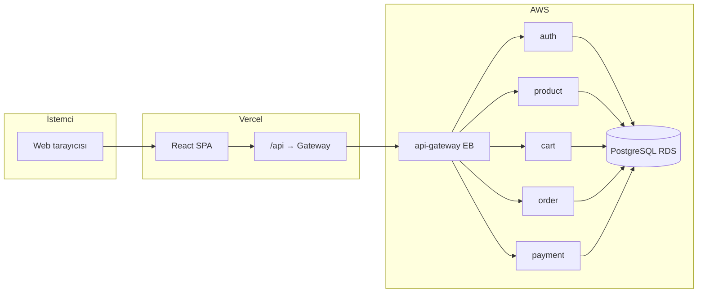

# Commerce — E-ticaret (Mikroservis + React)

Bu depo, **Spring Boot** mikroservis backend’i, **Spring Cloud Gateway**, **PostgreSQL**, **React (Vite)** frontend’i ve **AWS** üzerinde çalışan dağıtım örneklerini içeren bitirme / bootcamp projesidir. Tek giriş noktası **API Gateway**; mobil ve web istemcileri gateway üzerinden servislere ulaşır.

**Canlı frontend (Vercel):** [https://n11-final-project.vercel.app/](https://n11-final-project.vercel.app/) — tarayıcıdan API çağrıları aynı origin üzerinden `/api/...` ile gateway’e proxylanır (`frontend/vercel.json`).

---

## İçindekiler

1. [Özet mimari](#özet-mimari)
2. [Teknoloji yığını](#teknoloji-yığını)
3. [Repo yapısı](#repo-yapısı)
4. [Servisler ve portlar](#servisler-ve-portlar)
5. [Yerelde çalıştırma](#yerelde-çalıştırma)
6. [Ortam değişkenleri](#ortam-değişkenleri)
7. [Güvenlik](#güvenlik)
8. [Testler](#testler)
9. [API dokümantasyonu (Swagger, OpenAPI, Actuator)](#api-dokümantasyonu)
10. [DevOps ve CI/CD](#devops-ve-cicd)
11. [AWS (Elastic Beanstalk, ECR, RDS)](#aws-elastic-beanstalk-ecr-rds)
12. [Canlı frontend (Vercel)](#canlı-frontend-vercel)
13. [Ödeme (İyzico)](#ödeme-iyzico)
14. [Sık sorunlar](#sık-sorunlar)

---

## Özet mimari



- **Yerelde:** İstemci çoğu zaman doğrudan `http://localhost:8080` (gateway) veya Vite proxy ile konuşur.
- **Canlıda:** Örnek kurulumda istemci **Vercel** üzerinde; `vercel.json` ile `/api` istekleri **Elastic Beanstalk** üzerindeki gateway’e yönlendirilir (HTTPS sayfa → HTTP API mixed content engelini aşmak için).

---

## Teknoloji yığını

| Katman | Teknoloji |
|--------|-----------|
| Dil / runtime | **Java 21** |
| Backend | **Spring Boot 4.0.x**, **Spring Cloud 2025.1** (Gateway Server WebFlux) |
| Veri | **PostgreSQL 16**, Spring Data JPA |
| Güvenlik | **Spring Security**, **JWT** (jjwt) |
| Ödeme | **iyzipay-java** (İyzico API) |
| API dokümantasyonu | **springdoc-openapi** (Swagger UI) |
| Frontend | **React 19**, **Vite**, **TanStack Query**, **React Router** |
| Konteyner | **Docker** (çok aşamalı `Dockerfile`), **Jib** (Maven ile imaj üretimi) |
| CI | **GitHub Actions** (`./mvnw verify`) |
| Bulut | **AWS ECR**, **Elastic Beanstalk** (Docker), **RDS** |

---

## Repo yapısı

| Yol | Açıklama |
|-----|----------|
| `pom.xml` | Maven üst proje; tüm modülleri listeler |
| `libs/commerce-common` | Ortak API tipleri, istisnalar |
| `libs/commerce-jwt-resource` | JWT yardımcıları ve güvenlik bileşenleri |
| `services/auth-service` | Kayıt, giriş, `GET /api/v1/me` |
| `services/product-service` | Ürün kataloğu, sayfalama, dahili stok endpoint’i |
| `services/cart-service` | Sepet satırları; ürün servisi ile doğrulama |
| `services/order-service` | Sipariş oluşturma; sepet + ürün + stok + sepet temizleme |
| `services/payment-service` | İyzico ödeme başlatma / callback |
| `gateway/api-gateway` | Tek HTTP girişi, rota ve CORS |
| `frontend/` | React SPA (`npm run dev` / `npm run build`) |
| `docker/` | Ortak `Dockerfile` hedefleri (`--target auth-service` vb.) |
| `docker-compose.yml` | Yerel PostgreSQL + tüm servisler + gateway |
| `elasticbeanstalk/` | EB için `Dockerrun.aws.json` ve `.ebextensions` örnekleri (fazlı) |
| `.github/workflows/` | `ci.yml`, `deploy.yml` |
| `DEVOPS.md` | Slack secret, Jenkins karşılaştırması, Jib notları |

---

## Servisler ve portlar

| Modül | Varsayılan port | Kısa açıklama |
|-------|------------------|---------------|
| **api-gateway** | 8080 | `/api/v1/**` rotalarını ilgili servise iletir |
| **auth-service** | 8081 | JWT üretimi, kullanıcı kaydı |
| **product-service** | 8082 | Liste + detay + stok |
| **cart-service** | 8083 | Kullanıcı sepeti |
| **order-service** | 8084 | Sipariş + stok düşürme (product internal API) |
| **payment-service** | 8085 | İyzico |

Gateway’de rota ve CORS ayarları `gateway/api-gateway/src/main/resources/application.yml` içindedir. **Spring Cloud Gateway 5** ile rota kökü `spring.cloud.gateway.server.webflux` altında tanımlanmalıdır.

---

## Yerelde çalıştırma

### Gereksinimler

- **JDK 21**, **Docker** (Compose için), **Node.js 20+** (frontend için).

### Backend + PostgreSQL (Docker Compose)

Depo kökünde:

```bash
docker compose up --build -d
```

- PostgreSQL varsayılan kullanıcı/şifre `docker-compose.yml` içindedir; init script çoklu veritabanlarını oluşturur (`docker/postgres-init/`).
- **Spring Boot Actuator:** Her serviste ve gateway’de **`GET /actuator/health`** uçları açıktır; Docker Compose sağlık kontrolleri bu yolu kullanır (ör. `http://localhost:8080/actuator/health` … `http://localhost:8085/actuator/health`).
- API tabanı: **http://localhost:8080** (gateway).

Durdurmak: `docker compose down`.

### Sadece Maven (IDE veya terminal)

1. PostgreSQL’i ayağa kaldırın (Compose’dan sadece `postgres` servisi yeterli).
2. Her modül için `application.yml` içindeki DB host / isimlerini yerel ortama göre ayarlayın.
3. Gateway’e `AUTH_URI`, `PRODUCT_URI`, `CART_URI`, `ORDER_URI`, `PAYMENT_URI` değerlerini verin (ör. `http://localhost:8081` … `8085`).

Kökten tam doğrulama:

```bash
./mvnw -B verify
```

### Frontend

```bash
cd frontend
npm install
npm run dev
```

- Geliştirmede API istekleri genelde Vite proxy veya boş taban URL ile gateway’e gider.
- Üretim build’inde `VITE_API_BASE_URL` kullanımı `frontend/src/lib/api.ts` dosyasında açıklanmıştır.

---

## Ortam değişkenleri

Özet (tam listeler her servisin `application.yml` dosyasında):

| Servis | Önemli değişkenler |
|--------|-------------------|
| **auth** | `AUTH_DB_*`, `APP_JWT_SECRET`, `AUTH_SERVICE_PORT`, `PORT` (EB) |
| **product** | `PRODUCT_DB_*`, `COMMERCE_INTERNAL_SERVICE_TOKEN`, `PORT` |
| **cart** | `CART_DB_*`, `PRODUCT_SERVICE_URL`, `APP_JWT_SECRET`, `COMMERCE_INTERNAL_SERVICE_TOKEN`, `PORT` |
| **order** | `ORDER_DB_*`, `CART_SERVICE_URL`, `PRODUCT_SERVICE_URL`, `COMMERCE_INTERNAL_SERVICE_TOKEN`, `PORT` |
| **payment** | `ORDER_SERVICE_URL`, `AUTH_SERVICE_URL`, `APP_IYZICO_*`, `APP_IYZICO_CALLBACK_URL`, `PORT` |
| **gateway** | `AUTH_URI`, `PRODUCT_URI`, `CART_URI`, `ORDER_URI`, `PAYMENT_URI`, `PORT` / `GATEWAY_PORT` |

**Dahili çağrılar:** `order-service` ve `payment-service` ürün / sepet / stok için `X-Service-Token` başlığı kullanır; tüm ilgili ortamlarda **`COMMERCE_INTERNAL_SERVICE_TOKEN` aynı değerde** olmalıdır.

---

## Güvenlik

- **Kullanıcı API’leri:** `Authorization: Bearer <JWT>`.
- **Servisler arası `/internal/...`:** `X-Service-Token` (yukarıdaki ortak token).
- **CORS:** Hem gateway’de hem MVC servislerinde `WebConfig` / `globalcors` ile canlı frontend origin’leri tanımlanmalıdır (ör. Vercel HTTPS adresi).

---

## Testler

- **Unit ve integration testler** servis ve gateway modüllerinde `src/test/java` altındadır.
- Tam proje doğrulaması: `./mvnw -B verify`.

---

## API dokümantasyonu

**springdoc-openapi** ile her mikroserviste **Swagger UI** ve **OpenAPI 3** JSON uçları açıktır (`services/*/src/main/resources/application.yml` içinde `springdoc.swagger-ui.path`).

**Not:** `api-gateway` üzerinde birleşik Swagger yok; dokümantasyonu görmek için ilgili servisin **doğrudan** adresine gidin (yerelde port, AWS’te ilgili EB ortamının URL’si).

### Yerel (Docker Compose veya `localhost` ile çalışan servisler)

| Servis | Swagger UI | OpenAPI (`/v3/api-docs`) |
|--------|------------|---------------------------|
| **auth-service** (:8081) | [http://localhost:8081/swagger-ui.html](http://localhost:8081/swagger-ui.html) | [http://localhost:8081/v3/api-docs](http://localhost:8081/v3/api-docs) |
| **product-service** (:8082) | [http://localhost:8082/swagger-ui.html](http://localhost:8082/swagger-ui.html) | [http://localhost:8082/v3/api-docs](http://localhost:8082/v3/api-docs) |
| **cart-service** (:8083) | [http://localhost:8083/swagger-ui.html](http://localhost:8083/swagger-ui.html) | [http://localhost:8083/v3/api-docs](http://localhost:8083/v3/api-docs) |
| **order-service** (:8084) | [http://localhost:8084/swagger-ui.html](http://localhost:8084/swagger-ui.html) | [http://localhost:8084/v3/api-docs](http://localhost:8084/v3/api-docs) |
| **payment-service** (:8085) | [http://localhost:8085/swagger-ui.html](http://localhost:8085/swagger-ui.html) | [http://localhost:8085/v3/api-docs](http://localhost:8085/v3/api-docs) |

Korumalı uçları Swagger’den denemek için ilgili serviste **Authorize** alanına `Bearer <JWT>` girmeniz gerekir (önce auth servisinden giriş yapıp token alın).

### AWS Elastic Beanstalk — Swagger / OpenAPI

Aşağıdaki taban adresler **us-east-1** Elastic Beanstalk ortamlarıdır (nginx **80**; yol sonuna `/` koymadan kullanın).

| Servis | Swagger UI | OpenAPI (`/v3/api-docs`) |
|--------|------------|---------------------------|
| **auth-service** | [http://commerce-auth-env.eba-p3e2kxpx.us-east-1.elasticbeanstalk.com/swagger-ui.html](http://commerce-auth-env.eba-p3e2kxpx.us-east-1.elasticbeanstalk.com/swagger-ui.html) | [http://commerce-auth-env.eba-p3e2kxpx.us-east-1.elasticbeanstalk.com/v3/api-docs](http://commerce-auth-env.eba-p3e2kxpx.us-east-1.elasticbeanstalk.com/v3/api-docs) |
| **product-service** | [http://commerce-product-env.eba-p3e2kxpx.us-east-1.elasticbeanstalk.com/swagger-ui.html](http://commerce-product-env.eba-p3e2kxpx.us-east-1.elasticbeanstalk.com/swagger-ui.html) | [http://commerce-product-env.eba-p3e2kxpx.us-east-1.elasticbeanstalk.com/v3/api-docs](http://commerce-product-env.eba-p3e2kxpx.us-east-1.elasticbeanstalk.com/v3/api-docs) |
| **cart-service** | [http://commerce-cart-env.eba-p3e2kxpx.us-east-1.elasticbeanstalk.com/swagger-ui.html](http://commerce-cart-env.eba-p3e2kxpx.us-east-1.elasticbeanstalk.com/swagger-ui.html) | [http://commerce-cart-env.eba-p3e2kxpx.us-east-1.elasticbeanstalk.com/v3/api-docs](http://commerce-cart-env.eba-p3e2kxpx.us-east-1.elasticbeanstalk.com/v3/api-docs) |
| **order-service** | [http://commerce-order-env.eba-p3e2kxpx.us-east-1.elasticbeanstalk.com/swagger-ui.html](http://commerce-order-env.eba-p3e2kxpx.us-east-1.elasticbeanstalk.com/swagger-ui.html) | [http://commerce-order-env.eba-p3e2kxpx.us-east-1.elasticbeanstalk.com/v3/api-docs](http://commerce-order-env.eba-p3e2kxpx.us-east-1.elasticbeanstalk.com/v3/api-docs) |
| **payment-service** | [http://commerce-payment-env.eba-p3e2kxpx.us-east-1.elasticbeanstalk.com/swagger-ui.html](http://commerce-payment-env.eba-p3e2kxpx.us-east-1.elasticbeanstalk.com/swagger-ui.html) | [http://commerce-payment-env.eba-p3e2kxpx.us-east-1.elasticbeanstalk.com/v3/api-docs](http://commerce-payment-env.eba-p3e2kxpx.us-east-1.elasticbeanstalk.com/v3/api-docs) |

### AWS Elastic Beanstalk — Spring Boot Actuator (`/actuator/health`)

`management.endpoints.web.exposure` ile **`health`** (ve çoğu serviste `info`) yayınlanır. Dışarıdan **GET** ile hızlı kontrol:

| Bileşen | `GET .../actuator/health` |
|---------|---------------------------|
| **api-gateway** | [http://commerce-api-gateway-env.eba-p3e2kxpx.us-east-1.elasticbeanstalk.com/actuator/health](http://commerce-api-gateway-env.eba-p3e2kxpx.us-east-1.elasticbeanstalk.com/actuator/health) |
| **auth-service** | [http://commerce-auth-env.eba-p3e2kxpx.us-east-1.elasticbeanstalk.com/actuator/health](http://commerce-auth-env.eba-p3e2kxpx.us-east-1.elasticbeanstalk.com/actuator/health) |
| **product-service** | [http://commerce-product-env.eba-p3e2kxpx.us-east-1.elasticbeanstalk.com/actuator/health](http://commerce-product-env.eba-p3e2kxpx.us-east-1.elasticbeanstalk.com/actuator/health) |
| **cart-service** | [http://commerce-cart-env.eba-p3e2kxpx.us-east-1.elasticbeanstalk.com/actuator/health](http://commerce-cart-env.eba-p3e2kxpx.us-east-1.elasticbeanstalk.com/actuator/health) |
| **order-service** | [http://commerce-order-env.eba-p3e2kxpx.us-east-1.elasticbeanstalk.com/actuator/health](http://commerce-order-env.eba-p3e2kxpx.us-east-1.elasticbeanstalk.com/actuator/health) |
| **payment-service** | [http://commerce-payment-env.eba-p3e2kxpx.us-east-1.elasticbeanstalk.com/actuator/health](http://commerce-payment-env.eba-p3e2kxpx.us-east-1.elasticbeanstalk.com/actuator/health) |

`info` uçları aynı host üzerinde **`/actuator/info`** ile denenebilir (yapılandırmada açıksa).

---

## DevOps ve CI/CD

- Ayrıntılı anlatım: **[DEVOPS.md](DEVOPS.md)** (GitHub Actions, Slack webhook secret, Jenkins karşılaştırması, Jib örnekleri).
- **CI:** `.github/workflows/ci.yml` — `main` / `master` push ve PR’da `mvnw verify`.
- **Manuel deploy şablonu:** `.github/workflows/deploy.yml`.

---

## AWS (Elastic Beanstalk, ECR, RDS)

- Fazlı zip örnekleri ve port/nginx notları: **[elasticbeanstalk/README.md](elasticbeanstalk/README.md)**.
- Akış özeti:
  1. **RDS PostgreSQL** oluştur; güvenlik grubunda **5432** için her EB ortamının **instance security group**’una izin ver.
  2. **ECR**’de `commerce/<servis>` repoları; imajları **`linux/amd64`** ile build edip push et (`docker buildx build ... --push`).
  3. Her faz için `Dockerrun.aws.json` içindeki imaj URI’sini güncelle, zip oluştur, EB ortamına **Upload and deploy**.
  4. Gateway ortamında tüm servislerin **HTTP** taban URL’lerini env olarak ver.

**Not:** Varsayılan AWS hesabında **Elastic IP** kotası düşük olabilir; altıncı tek-instance ortam için kota artırımı veya load balanced gateway düşünülmelidir.

---

## Canlı frontend (Vercel)

- **Yayın adresi:** [https://n11-final-project.vercel.app/](https://n11-final-project.vercel.app/)
- `frontend/vercel.json`:
  - **`/api/*` →** gateway Elastic Beanstalk URL’si (sunucu taraflı proxy; mixed content sorununu giderir).
  - **`/(.*)` → `/index.html`** — SPA’da doğrudan `/register` gibi yollara yenilemede 404 almamak için.
- Vercel’de **`VITE_API_BASE_URL` tanımlamayın** (veya boş bırakın); istekler aynı origin üzerinden `/api/...` gider.

---

## Ödeme (İyzico)

- **Sandbox** anahtarları `payment-service` ortam değişkenleriyle verilir.
- **`APP_IYZICO_CALLBACK_URL`** gerçek kullanıcı akışında gateway’in dışarıdan erişilen adresine (ve doğru path’e) işaret etmelidir.
- Sandbox panel / SMS doğrulaması tarafında sorun yaşanırsa, bu **İyzico hesap sürecidir**; SDK kaynağı (`iyzipay-java`) entegrasyonu değiştirmez.

---

## Sık sorunlar

| Belirti | Olası neden |
|---------|-------------|
| EB’de `AWSEBEIP` / EIP limiti | Hesapta 5 EIP dolu; kota artırımı veya load balanced gateway |
| Vercel’de mixed content | Sayfa HTTPS, API HTTP; `vercel.json` proxy veya API önüne HTTPS (CloudFront) |
| Kayıt / giriş 403 | Servis `WebConfig` CORS listesinde canlı frontend origin yok |
| Siparişte 500 | `order` → `product` dahili stok URL’si uyuşmazlığı veya internal token uyumsuzluğu |
| CI’da `./mvnw` yok | Kökte `mvnw`, `mvnw.cmd`, `.mvn/wrapper/` dosyalarının repoda olduğundan emin olun |

---

## Katkı ve teslim

- Kod stili mevcut modüllerle uyumlu tutulmalı; gereksiz dosya ve gizli anahtar commit edilmemelidir.
- Teslimde: **repo linki**, canlı **frontend** ve **API** adresleri, kısa test senaryosu (kayıt → ürün → sepet → sipariş) önerilir.

---

*Bu README, projenin uçtan uca anlatımı için güncellenmiştir. AWS bölgesi, domain ve EB ortam adları kendi hesabınıza göre değişir.*
